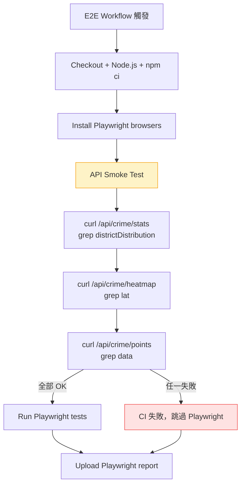

### 任務報告：CI API Smoke Test — 2026-06-17

#### 1. 主要解決什麼問題？
在 E2E workflow 的 Playwright 測試之前加入 API smoke test step，
用 curl 驗證三個核心 API 端點（stats、heatmap、points）回傳 200 且
body 包含預期欄位。目的是在 Playwright 瀏覽器測試之前快速確認後端
API 可用，若 API 不通則提前失敗，節省 Playwright 啟動和執行的時間。

#### 2. 如何證明是否執行正確？
- 手動觸發 E2E workflow（`gh workflow run E2E --ref uat`）
- 第一次失敗：curl 預設無 retry，UAT 冷啟動 19 秒後 timeout（PR #76）
- 第二次失敗：加了 retry 但 grep pattern 錯誤 — `"totalCount"` 不存在
  於 `CrimeStatsDto`，實際欄位是 `districtDistribution`（PR #77）
- 第三次成功：修正 pattern + 加入診斷輸出（PR #78），E2E 全綠通過
  （run `27721566915`，含 smoke test + Playwright，1h0m28s）

#### 3. 怎樣才是好的作法？
- Smoke test 應在重量級測試（Playwright）之前執行，快速失敗
- `curl -sf` 靜音模式在失敗時完全無診斷資訊，改用自訂函式印出
  HTTP status + body 前 100 字元，便於 CI log 排查
- UAT 可能冷啟動，curl 需要 `--retry 3 --retry-delay 10 --retry-all-errors`
- grep 的 pattern 必須與實際 API 回傳格式一致，不能憑記憶假設

#### 4. 最重要的知識或概念
1. **Smoke test 與 E2E 的分層**：Smoke test 用最低成本（curl）驗證
   API 基本可用性；E2E 用瀏覽器驗證使用者流程。兩者互補，不互相取代。
2. **冷啟動容錯**：Azure Container Apps 的容器可能 scale to 0，
   第一個請求需要等容器啟動，CI 中的 HTTP 請求必須有 retry 機制。
3. **API 契約即測試依據**：grep 的 pattern 必須來自實際的 DTO 定義，
   不能憑印象填寫。`CrimeStatsDto` 沒有 `totalCount`，只有
   `districtDistribution` 和 `timeSlotDistribution`。

#### 5. 核心的變因是什麼？
- UAT 冷啟動時間（0~60 秒不等）決定 curl 是否需要 retry
- API 回傳格式（DTO 結構）決定 grep pattern 是否正確
- curl 的錯誤處理模式（`-sf` vs 自訂函式）決定失敗時的可診斷性

#### 6. 新手可能常犯的誤區？
- 用 `curl -sf` 但不印出回應內容，失敗時完全無法判斷是 HTTP 錯誤
  還是 body 不匹配
- 假設 API 欄位名稱而不查 DTO 定義（`totalCount` vs `districtDistribution`）
- 忘記 UAT 有冷啟動延遲，CI 的第一個 HTTP 請求可能直接 timeout
- `/api/crime/points` 回傳 `PagedResult`（物件）不是 JSON array，
  grep `[` 不會匹配

#### 7. 流程圖

#### 8. 分支與部署記錄
- 開發分支：feature/api-smoke-test、fix/smoke-test-retry、fix/smoke-test-debug
- PR 編號：#76（新增 smoke test）、#77（加 retry）、#78（修正 pattern）
- Merge 到：uat
- Merge 時間：2026-06-17
- CI 結果：✅ 成功（E2E run 27721566915）
- UAT 部署：N/A（僅 workflow 變更，不影響應用部署）
