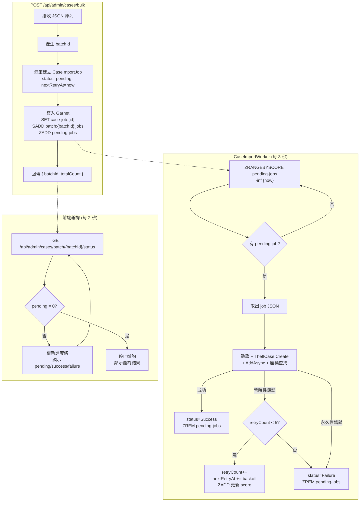

### 任務報告：Garnet Queue 背景寫入機制 — 2026-06-18

#### 1. 主要解決什麼問題？
原有的 `POST /api/admin/cases/bulk` 是同步逐筆寫入 DB，大量匯入時
HTTP 請求長時間佔用、前端無法得知進度、任何一筆 DB 暫時性錯誤
（timeout、連線中斷）會直接回傳失敗且無法重試。改為非同步佇列機制：
API 只負責排入 Garnet，背景 Worker 負責處理，前端輪詢進度。

#### 2. 如何證明是否執行正確？
- `dotnet test` 159 個測試全部通過（新增 7 個 Worker 測試 + 2 個整合測試調整）
- Worker 測試驗證：退避時間計算（2/5/12/28 秒）、暫時性錯誤判定
  （TimeoutException、RedisConnectionException → true）、永久性錯誤判定
  （DomainException、FormatException → false）
- 整合測試驗證：bulk API 回傳 batchId + totalCount 格式正確

#### 3. 怎樣才是好的作法？
- 用 ZSET（Sorted Set）的 score 存放 NextRetryAt，Worker 只需
  `ZRANGEBYSCORE pending-jobs -inf {now}` 即可精準取出到期的 job，
  不需要遍歷所有 job
- 暫時性 vs 永久性錯誤分開處理：DB timeout 可以重試，資料格式錯誤
  直接標記失敗，避免無意義的重試浪費資源
- 退避時間用 lookup array `[2, 5, 12, 28]` 而非公式，可讀性最高、
  維護最簡單、測試最容易
- 所有 Garnet key 設 7 天 TTL，避免無限成長

#### 4. 最重要的知識或概念
1. **非同步佇列模式**：API 只負責「收件」（寫入佇列），不負責「處理」
   （寫入 DB）。就像郵局收包裹和送包裹是分開的，收件很快，送件慢慢來。
2. **指數退避（Exponential Backoff）**：錯誤時不是馬上重試，
   而是等越來越久（2→5→12→28 秒），給系統恢復的時間，
   避免「一直敲門反而讓問題更嚴重」。
3. **暫時性 vs 永久性錯誤**：網路斷線是暫時的（等一下就好了），
   資料格式錯誤是永久的（等再久也不會自己修好）。
   區分這兩種決定是否值得重試。

#### 5. 核心的變因是什麼？
- Garnet 可用性：Garnet 掛掉時 enqueue 會失敗，需要 graceful error handling
- DB 可用性：冷啟動或 Azure SQL 暫停時，Worker 的暫時性錯誤判定
  決定是否重試
- 重試次數上限（5 次）和退避間隔決定了最長等待時間
  （2+5+12+28 = 47 秒後放棄）

#### 6. 新手可能常犯的誤區？
- 把所有錯誤都當暫時性錯誤重試 → 永久性錯誤永遠不會成功，
  浪費 5 次重試 + 47 秒
- 用 `KEYS *` 或 `SCAN` 掃描所有 job 找 pending →
  O(N) 效能，job 越多越慢；ZSET 的 ZRANGEBYSCORE 是 O(log N + M)
- Worker 處理 job 時沒有 catch 個別 job 的錯誤 →
  一筆失敗導致整個 loop 中斷，後續 job 都不處理
- 忘記在 ZSET 更新 score 或 ZREM → 已完成的 job 被重複處理

#### 7. 流程圖

#### 8. 分支與部署記錄
- 開發分支：uat（直接 push）
- Commit：`66a5aba`
- Merge 到：uat
- Merge 時間：2026-06-18
- CI 結果：待確認（本機 159 測試全過）
- UAT 部署：待 CI 完成
