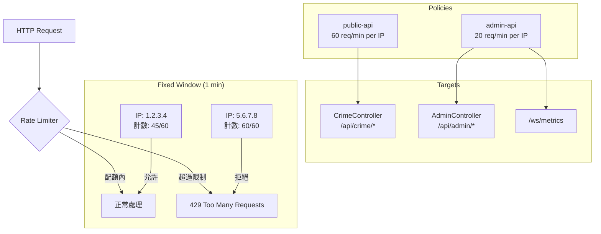

### 任務報告：ASP.NET Core Rate Limiting — 2026-06-18

#### 1. 主要解決什麼問題？
公開 API 沒有請求頻率限制，任何人可以無限制地打 API，可能造成
伺服器過載或被惡意濫用。加入 ASP.NET Core 內建的 Rate Limiting，
不需額外套件，對公開查詢 API 和管理 API 分別設定不同的頻率上限。

#### 2. 如何證明是否執行正確？
- CI 全綠通過（build-and-test + E2E playwright + push-to-acr + deploy-to-uat）
- 整合測試：用獨立 WebApplicationFactory 設 limit=3，驗證第 4 次請求回傳 429
- 經歷兩次 CI 失敗並修正：
  - 第一次：rate limit 測試耗盡共用 Factory 配額，其他測試也收到 429
  - 第二次：`builder.Configuration.GetValue()` 在 `WithWebHostBuilder` 覆蓋前就讀取，測試設定沒生效

#### 3. 怎樣才是好的作法？
- 公開 API 和管理 API 分開設定不同 policy，管理 API 限制更嚴格
- Rate limit 值應可設定（透過 `IConfiguration`），方便測試覆蓋和環境調整
- 讀取設定值的時機很重要：不能在 `builder` 階段讀（測試覆蓋尚未生效），
  要在 `AddPolicy` lambda 裡從 `HttpContext.RequestServices` 讀取
- Rate limit 測試必須用獨立的 `WebApplicationFactory`，避免與其他測試
  共享 rate limiter 計數器

#### 4. 最重要的知識或概念
1. **Fixed Window Rate Limiting**：把時間切成固定大小的格子（例如 1 分鐘），
   每個格子內最多允許 N 次請求。就像停車場有 60 個車位，每分鐘重新清空，
   滿了就不讓進（429）。
2. **Partition Key**：rate limiter 按 IP 分開計數，每個 IP 有自己的配額。
   不同使用者互不影響。
3. **設定讀取時機（Configuration Timing）**：ASP.NET Core 的 
   `WebApplicationFactory.WithWebHostBuilder` 覆蓋在 `builder.Build()` 
   之後才生效。如果在 builder 階段就用 `GetValue()` 讀了設定值並存成變數，
   測試的覆蓋值永遠讀不到。

#### 5. 核心的變因是什麼？
- Partition Key（IP 地址）決定不同使用者的配額是否獨立
- Window 大小（1 分鐘）和 PermitLimit（60/20）決定限制的嚴格程度
- QueueLimit=0 表示不排隊直接拒絕，避免請求堆積
- 測試環境的設定覆蓋時機決定測試能否正確驗證 429 行為

#### 6. 新手可能常犯的誤區？
- 在 `builder` 階段讀設定值存成變數，以為測試覆蓋會生效 →
  實際上 `WithWebHostBuilder` 的覆蓋在之後才套用
- Rate limit 測試和其他測試共用 WebApplicationFactory →
  測試耗盡配額後，後續所有測試都收到 429
- TestServer 的 `RemoteIpAddress` 是 null →
  partition key 變成 `"unknown"`，所有測試請求共用同一個計數器
- 忘記 `QueueLimit=0` → 超過限制的請求會排隊等待而非立即拒絕，
  導致回應變慢而非快速回 429

#### 7. 流程圖

#### 8. 分支與部署記錄
- 開發分支：feature/rate-limiting、fix/rate-limit-tests
- PR 編號：#84（rate limiting）、#85（uat → main）、#86（test fix）
- Merge 到：main
- Merge 時間：2026-06-18 08:56 UTC
- CI 結果：✅ 成功（第三次，前兩次因測試互相干擾失敗）
- Prod 部署：✅（push-to-acr 成功，deploy-to-prod 待觸發）
