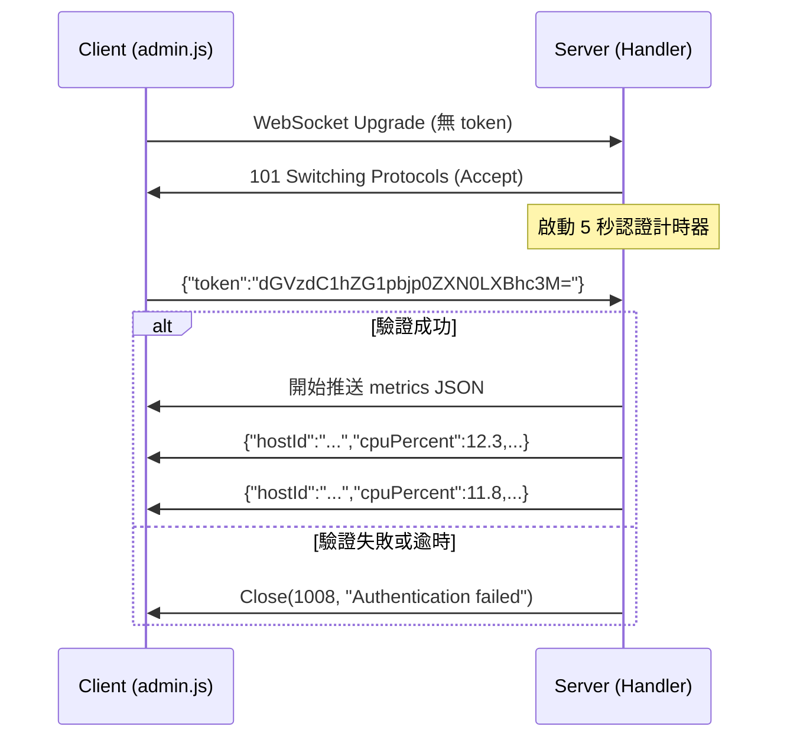

### 任務報告：WebSocket 認證改為連線後訊息傳遞 — 2026-06-18

#### 1. 主要解決什麼問題？
原本 WebSocket 的 token 放在 query string（`/ws/metrics?token=<base64>`），
這個 token 會被記錄在：反向代理 access log、瀏覽器歷史紀錄、
網路監控工具的 URL 欄位。改為連線建立後以第一個 WebSocket 訊息
`{"token":"<base64>"}` 傳遞，token 不再出現在 URL 中。

#### 2. 如何證明是否執行正確？
- 4 個整合測試全部重寫並通過：
  - 錯誤 token → 收到 1008 Policy Violation close
  - 不送 token（5 秒逾時）→ 1008 Policy Violation close
  - 正確 token → 連線保持 Open，收到指標資料
  - 認證後的指標 JSON 包含 hostId、cpuPercent、memoryMb 欄位
- CI 全綠（build-and-test + E2E + deploy-to-uat）

#### 3. 怎樣才是好的作法？
- WebSocket 先 Accept 再驗證（post-connect auth），而非在 HTTP
  升級前驗證（pre-connect auth）。前者讓 token 不出現在 URL
- 設定認證逾時（5 秒），避免客戶端連線後不發送 token 導致連線永遠佔用
- 認證失敗用 1008 Policy Violation close code（RFC 6455 定義的語義正確的代碼），
  而非直接斷線或回 1000 Normal Closure
- 前端在 `onopen` 事件裡立刻發送 token，不等其他操作

#### 4. 最重要的知識或概念
1. **URL 是不安全的傳輸通道**：URL 會被 log、cache、bookmark、
   referer header 等各種機制記錄。敏感資訊（token、密碼）不應放在 URL。
2. **WebSocket 的生命週期**：HTTP Upgrade → Accept → Open → 
   Message Exchange → Close。認證可以在 Upgrade 前（HTTP header）
   或 Accept 後（第一個 message）。後者更安全但需要額外的逾時保護。
3. **Close Code 語義**：1008 Policy Violation 表示「收到的訊息違反
   伺服器政策」，用於認證失敗最為恰當。

#### 5. 核心的變因是什麼？
- 認證逾時長度（5 秒）：太短可能在高延遲網路上誤判，太長會佔用資源
- Close code 的選擇：1008 vs 1003 vs 1000，影響客戶端的錯誤處理邏輯
- 前端發送 token 的時機：必須在 onopen 裡立刻發送，不能延遲

#### 6. 新手可能常犯的誤區？
- 把 token 放在 WebSocket URL 的 query string 裡，以為「反正是加密的
  HTTPS 連線所以安全」→ URL 仍會被 log 和 browser history 記錄
- Accept WebSocket 後忘記設認證逾時 → 未認證的連線永遠佔用伺服器資源
- 認證失敗時直接 `ws.Abort()` 而非 `ws.CloseAsync(1008)` →
  客戶端收不到有意義的關閉原因
- 測試中用 Header auth（`Authorization: Basic ...`）但實際程式碼
  已改為 message auth → 測試通過但行為不一致

#### 7. 流程圖

#### 8. 分支與部署記錄
- 開發分支：feature/ws-auth-message
- PR 編號：#87（feature → uat）、#88（uat → main）
- Merge 到：main
- Merge 時間：2026-06-18
- CI 結果：✅ 成功
- UAT 部署：✅ 成功
