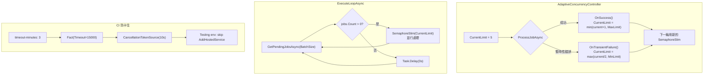

### 任務報告：AIMD 壅塞控制 + CI 卡住根因修正 — 2026-06-19

#### 1. 主要解決什麼問題？
CaseImportWorker 的並行度是固定值（MaxConcurrency=5），當 DB 負載高
（暫時性錯誤頻繁）時仍以固定速率打 DB，加劇壅塞；當 DB 空閒時
又不會自動提高吞吐量。同時 CI 整合測試會無限卡住，根因是
ServerMetricsService 和 CaseImportWorker 的背景迴圈在 Testing 環境
連上 Garnet 後無法乾淨退出。

#### 2. 如何證明是否執行正確？
- 8 個 AdaptiveConcurrencyController 測試：OnSuccess +1 到 MaxLimit 為止、
  OnTransientFailure /2 到 MinLimit 為止、連續 halving、初始值 clamp、
  1000 個並行 Task 的 thread-safety 驗證
- CI 全綠：build-and-test + E2E playwright 通過
- 本機 `time dotnet test`：171 個非 Integration 測試 5.8 秒乾淨退出、
  全量測試 13.8 秒乾淨退出（Integration 因本機無 SQL Server 失敗，但 process 正常退出）
- E2E popup test 連續 3 次全綠（run 27804913811, 27804964865, 27805034739）

#### 3. 怎樣才是好的作法？
- AIMD 用 `Interlocked.CompareExchange` CAS loop 實現 thread-safe，
  不用 lock（避免死鎖風險、效能更好）
- 背景服務（IHostedService）在 Testing 環境下 skip `AddHostedService`
  但保留 singleton 註冊，讓依賴注入仍能 resolve（WS handler 測試需要）
- WS 測試不依賴背景 loop 推送資料，改用手動呼叫 `BroadcastToClients`
  觸發一次推送，避免 timing 不穩定
- CI workflow 加 `timeout-minutes` 作為最後一道防線，即使所有
  code-level timeout 失效，CI 也不會無限卡住

#### 4. 最重要的知識或概念
1. **AIMD（Additive Increase, Multiplicative Decrease）**：
   網路壅塞控制的經典演算法。成功時慢慢加速（+1），
   失敗時快速減速（/2）。就像開車：路況好時慢慢加速，
   看到塞車立刻踩煞車減半速度。
2. **IHostedService 與測試的衝突**：背景服務在 WebApplicationFactory
   啟動時會真正執行，如果連上了外部服務（Garnet），Dispose 時
   可能無法乾淨退出，導致 test process 卡住。
3. **CAS loop（Compare-And-Swap）**：不用 lock 實現 thread-safe 的方式。
   讀取當前值 → 計算新值 → 嘗試替換 → 如果別人先改了就重試。
   像是排隊插隊：看到空位 → 嘗試坐下 → 被搶了就重新看。

#### 5. 核心的變因是什麼？
- 暫時性錯誤頻率決定 CurrentLimit 下降速度（每次 /2）
- 成功頻率決定 CurrentLimit 回升速度（每次 +1，比下降慢很多）
- MinLimit（1）確保不會完全停止處理
- MaxLimit（MaxConcurrency×2 或 20）限制不會無限放大
- Testing 環境的 Garnet 可用性決定背景服務是否會卡住

#### 6. 新手可能常犯的誤區？
- 用 `lock` 而非 `Interlocked` 實現 AIMD → 如果持鎖時間長或巢狀使用，
  可能造成死鎖
- 在 WebApplicationFactory 測試中啟動 IHostedService → 背景迴圈
  可能連上真實的外部服務（Redis/Garnet），Dispose 時卡住
- 測試 WS 推送時依賴背景 loop 的 timing → 不穩定，
  應改為手動觸發一次 broadcast
- CI 只靠 `[Fact(Timeout)]` 防卡住 → 對同步阻塞無效，
  必須在 workflow 層級加 `timeout-minutes`

#### 7. 流程圖

#### 8. 分支與部署記錄
- 開發分支：feature/aimd-concurrency、feature/worker-no-delay-on-backlog、feature/worker-batch-concurrency
- PR 編號：#91（batch+concurrency）、#93（skip delay）、#94（release）、#95（AIMD）、#96（release + CI fix）
- Merge 到：main
- Merge 時間：2026-06-19 12:43 UTC
- CI 結果：✅ 成功
- Prod 部署：✅ 成功
